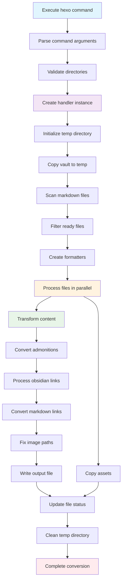

# Hexo Command

Hexo 命令用于将 Obsidian 笔记转换为 Hexo 博客文章，支持 Hexo Butterfly 主题的特定格式和要求。

整个 Command 的流程如下：

```mermaid
flowchart TD
    A[Execute hexo command] --> B[Parse command arguments]
    B --> C[Validate directories]
    C --> D[Create handler instance]

    D --> E[Initialize temp directory]
    E --> F[Copy vault to temp]
    F --> G[Scan markdown files]

    G --> H[Filter ready files]
    H --> I[Create formatters]
    I --> J[Process files in parallel]

    J --> K[Transform content]
    J --> L[Copy assets]

    K --> M[Convert admonitions]
    M --> N[Process obsidian links]
    N --> O[Convert markdown links]
    O --> P[Fix image paths]
    P --> Q[Write output file]

    Q --> R[Update file status]
    L --> R
    R --> S[Clean temp directory]
    S --> T[Complete conversion]

    style A fill:#e1f5fe
    style D fill:#f3e5f5
    style J fill:#fff3e0
    style K fill:#e8f5e8
    style T fill:#ffebee
```
